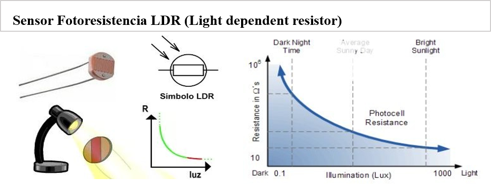
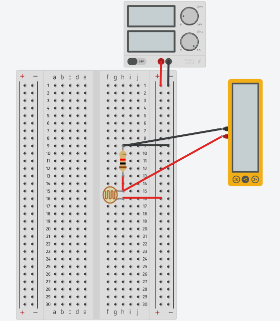
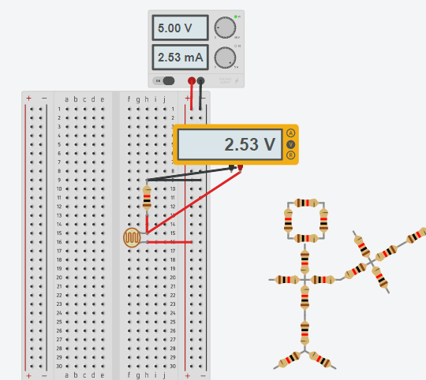
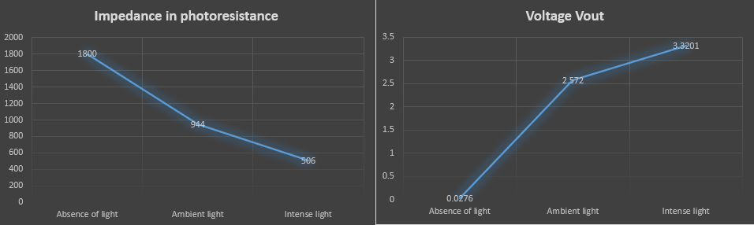
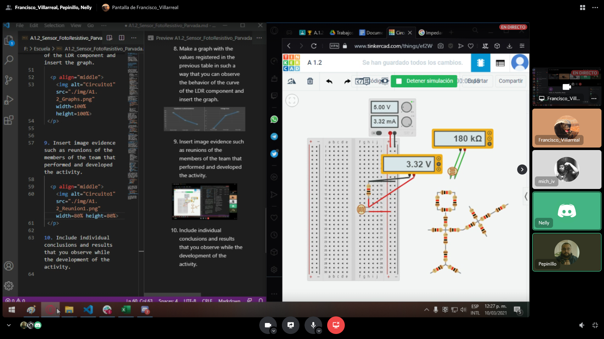
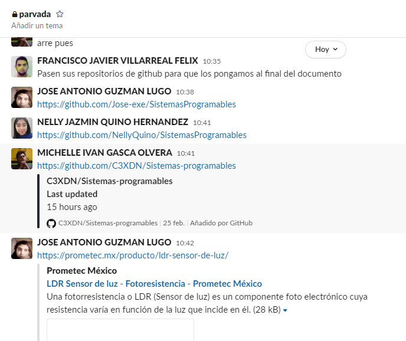
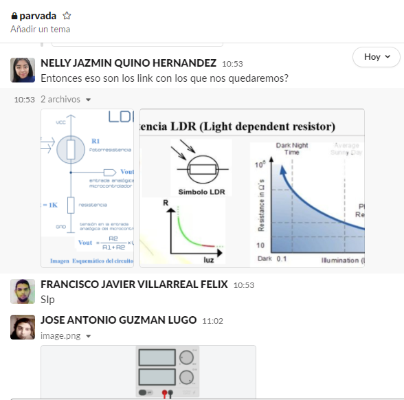

## :trophy: A.1.2 Actividad de aprendizaje

## Objetivo

Realizar un sensor medidor de luz (lux) a través de un circuito electrónico, utilizando un simulador, y un *LDR (Light dependent Resistor).*

**Circuito electrónico para uso con sensores y transductores, y simulación**

### :pencil2: Desarrollo
___

1. Use the next list of materials to elaborate the activity and add a column with the source of your *bibliographic link*.

    Cantidad | Descripción | Fuente de consulta | 
    ---------|----------|----------|
    1 | Sensor Fotoresistencia LDR de 2M | [geekbotelectronics.com](http://www.geekbotelectronics.com/producto/fotoresistencia-gl5537-2mohm/) |
    1 | Resistencia 1k | [tostatronic.com](https://tostatronic.com/store/es/componentes-pasivos/887-resistencia-1k-ohms-14w.html) |
    1 | Fuente de alimentación de 5v. | [uelectronics.com](https://uelectronics.com/producto/fuente-de-alimentacion-5v-10a/) |
    
2. Considering the LDR is and photosensitive element that is, its resistance varies in the base of the amount of light that insides over it, **What do you observe in the next graph?**
    

    
    

    
That if the more light the photoresistence detects the less resistance is showing and the less resistance the more voltage will go through.

3. Build the circuit in the image on the simulator of your choosing, placing the photoresistence in the position of the LDR and the resistance as shown in the image of the schematic:
 

    
 

 4. Position the final image you obtained of the circuit you build in the simulator.
  

    
 

 5. Measure the **resistance** of the photoresistance with the ohmeter under the next conditions: lack of light or darkness, ambient light, intense light and register in the corresponding table.

 6. Calculate the **value of voltage Vout theoretic** for each one of the conditions mentioned before as the value of voltage Vout measured and register in the corresponding table.
 
 7. Calculate the **exact vaslue** of voltage between the theoretic and the measured for each condition and register in the corresponding table.
 
     Condition | Impedance in photoresistance | Theoretical voltage Vout | Measured voltage Vout | % V.Measured/V.Theoretical | 
    ---------|----------|----------|----------|----------|
    Absence of light | 180**kohms** | 0.0276**V** | 27.7**mV** | 99% |
    Ambient light | 944**ohms** | 2.5720**V** | 2.57**V** | 100% |
    Intense light | 506**ohms** | 3.3201**V** | 3.37**V** | 98% |

8. Make a graph with the values registered in the previous table in such a way that you can observe the behavior of the curve of the LDR component and insert the graph.

  

    
 

9. Insert image evidence such as reunions of the members of the team that performed and developed the activity.

    
 

 

    
    

   

    
    

    
    

10. Include individual conclusions and results that you observe while the development of the activity.

## :beetle: Nelly Quino

 In this activity I notice that with the more amount of light the less resistance shows in the photoresistance. Also, that under the conditions we put the photoresistance if we increase the light the output voltage is more than the impedance in the resistance lowers 

## :frog: José Guzmán

We were able to verify that adding light to the photoresistor reduces its resistance, therefore more voltage passes. As shown in the graph that is in the activity in we were able to confirm this when adding the values to our on graph showing that the resistance did go down and the voltage went up. 

## :camera: Michelle Gasca

In the activity we verify that at the moment of exposing the photoresistance at a high amount of light, the resistance starts to lower. While at the voltage happens the contrary since the resistance goes down the voltage that passes goes up. 

## :coffee: Francisco Villarreal 

While making the activity I thought it would be harder to use the LDR, but it acts like a resistance just that it varies depending on the light, another thing that I notice while searching for the LDR is that while in the simulator we are stuck with a default max and mix resistance we can actually buy with more resistance depending on the project were going to do. Lastly we confirm what we saw in the graph of the activity with our on graph, the more light the less resistance and more voltage. 

### :bomb: Rubric

| Criteria| Description | Score |
| ------------- | -------------------------------------------------------------------------------------------- | ------- |
| Instrucciones | Do you fulfill each of the points indicated in the instruction section? | 10 |
| Desarrollo    | Did you answer each one of the points requested in the development of the activity?   | 60      |
|Demostración|Was the student present in the explanation of the functionality of the activity?|20| 
|Conclusiones|Se incluye una opinión personal de la actividad por cada uno de los integrantes del equipo?|10|

### :mortar_board: Members repositories
:beetle: [Nelly Quino](https://github.com/NellyQuino/SistemasProgramables)

:frog: [José Guzmán](https://github.com/Jose-exe/SistemasProgramables)

:camera: [Michelle Gasca](https://github.com/C3XDN/Sistemas-programables)

:coffee: [Francisco Villarreal](https://github.com/FranciscoVF/Sistemas-Programables/)