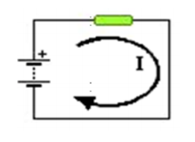
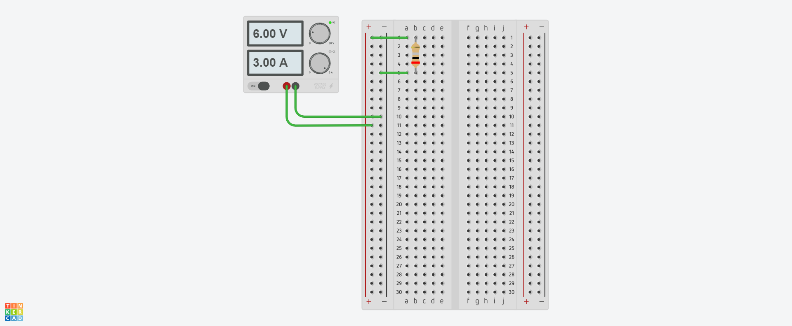
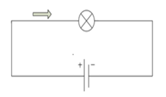
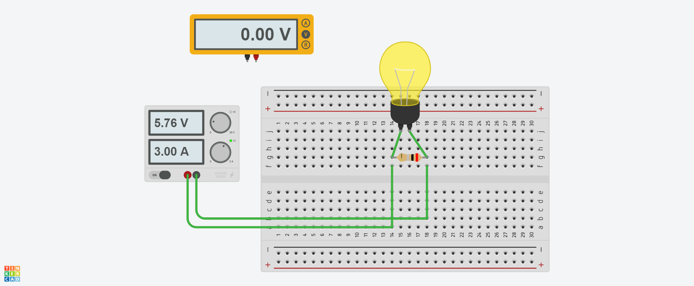
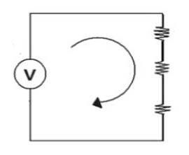
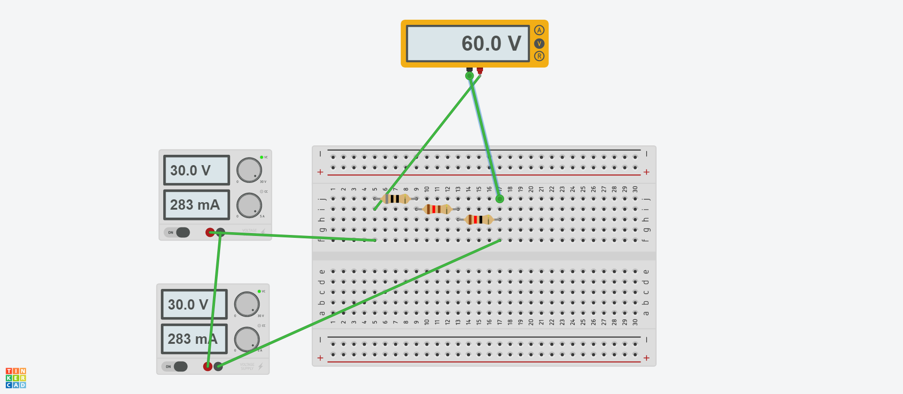
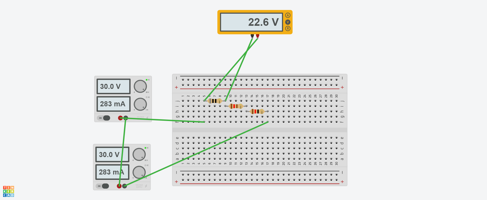
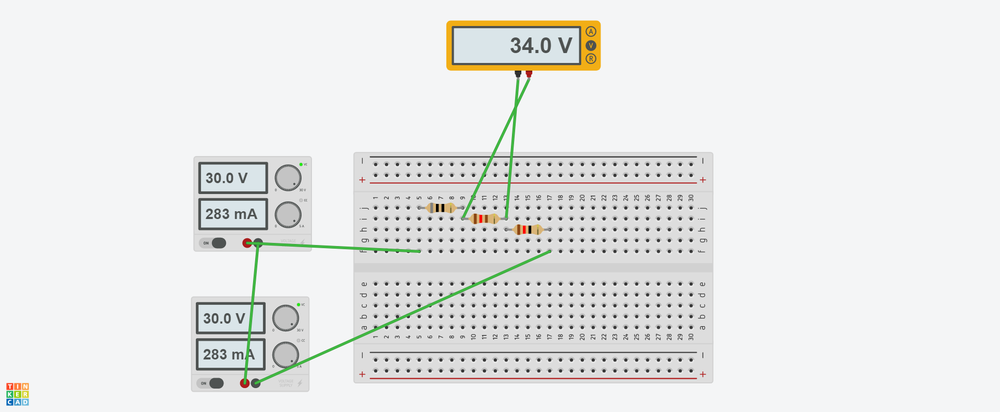
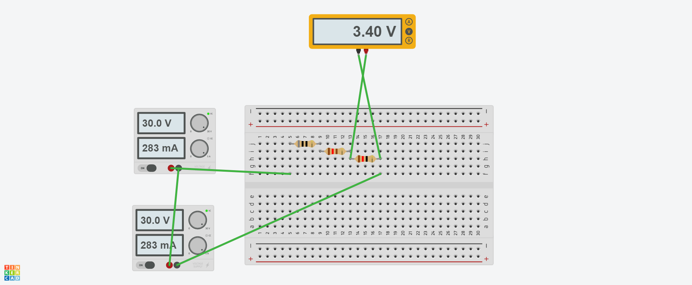

## :trophy: C1.2 Reto en clase

**Conceptos de electrónica básica y simulacion de circuitos**

### :blue_book: Instrucciones :blue_book:
___

- De acuerdo con la información presentada por el asesor referente al tema electrónica básica, contestar las preguntas indicadas dentro del apartado desarrollo 
- Diseñar los circuitos mostrados dentro de la herramienta ***tinkercad***.
- Analice los tres siguientes circuitos y responder a lo que se pregunta en cada uno de ellos, **explicando** como se obtuvo el resultado y una vez realizado los cálculos teóricos, utilice el simulador propuesto y diseñe los circuitos realizando la simulación y demostración de los resultados obtenidos.

### :pencil2: Desarrollo :pencil2:
___
**Circuitos electronicos**

1. Un circuito que tiene una pila de 6 voltios genera una corriente que atraviesa una resistencia eléctrica de 2 ohmios. Cual es el valor de la intensidad de la corriente que pasa por la resistencia?

    

            
    

    +  Registre sus cálculos obtenidos y los simulados 

    Elemento | Valor teórico | Valor simulación
    ---------|----------|---|
    Intensidad |3 amperes  | 3 amperes |
    

    + Coloque aquí las imágenes de evidencia de la simulación.
    

            
    

___

1. Encuentre la tensión de la pila que necesitas para que pase una corriente cuya intensidad es de 3 amperes por una bombilla que tiene 2 ohmios de resistencia.

    

        
    

    + Registre sus cálculos obtenidos y los simulados: 

    Elemento | Valor teórico | Valor simulación
    ---------|----------|---|
    Voltaje | 6 volts | 5.76 volts|

    + Coloque aquí las imágenes de evidencia de la simulación.
    

            
    

___

1. Encuentre la corriente eléctrica total y el voltaje en cada resistencia que se encuentra dentro del circuito, considerando los siguientes valores resistivos,

    

        
    

  + Registre sus cálculos obtenidos y los simulados: 
    Elemento | Valor teórico | Valor simulación
    ---------|----------|---|
    R1 | 80 ohms | 80 ohms |
    R2 | 120 ohms | 120 ohms |
    R3 | 12 ohms | 12 ohms |
    VT | 60 volts |60 volts |
    VR1 | 22.64 volts | 22.6 volts |
    VR2 | 33.96 volts | 34 volts|
    VR3 | 3.396 volts | 3.4 volts|
    IT |  0.2830188679 volts | 0.283 volts |

  + Coloque aquí las imágenes de evidencia de la simulación.
    

            
    

    

            
    

    

            
    

    

            
    

___

### :bomb: Rubrica :bomb:

| Criterios     | Descripción                                                                                  | Puntaje |
| ------------- | -------------------------------------------------------------------------------------------- | ------- |
| Instrucciones | Se cumple con cada uno de los puntos indicados dentro del apartado Instrucciones?            | 20 |
| Desarrollo    | Se respondió a cada uno de los puntos solicitados dentro del desarrollo de la actividad?     | 80      |

:house: [Ir a GitHub](https://github.com/C3XDN/Sistemas-programables/blob/master/readme.md) :house: