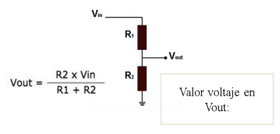
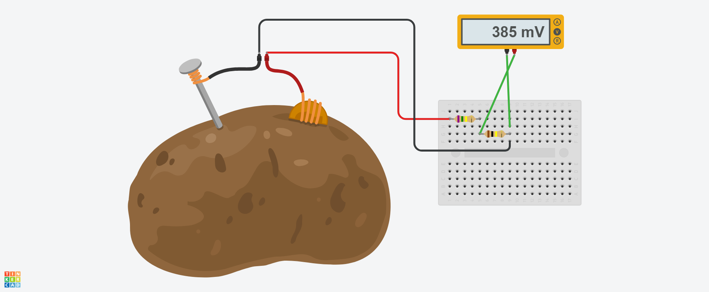
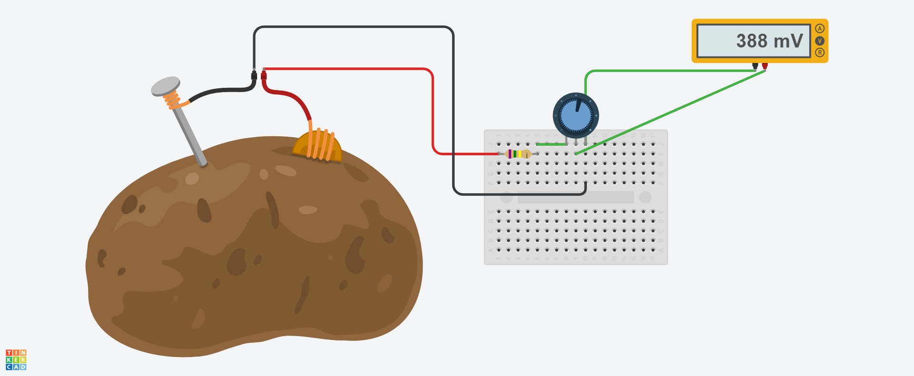
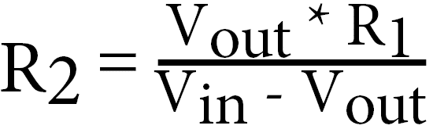
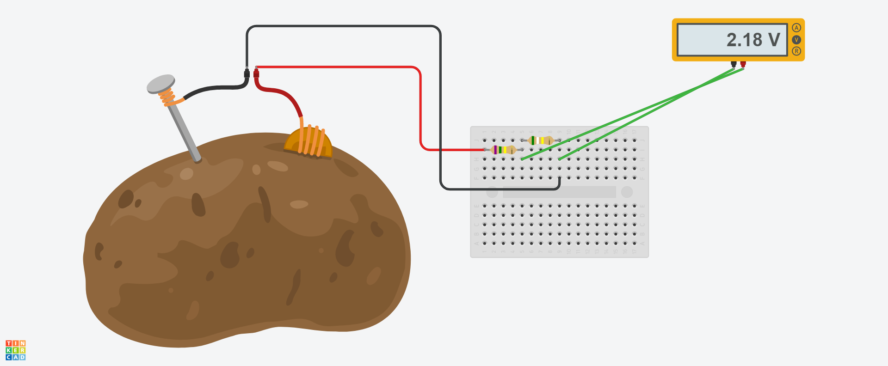

# Sensores
## :trophy: C1.3 Reto en clase :trophy:

**Circuito electrónico para uso con sensores y transductores, y simulación**

### :blue_book: Instrucciones :blue_book:
___
- De acuerdo con la información presentada por el asesor referente al tema sensores y transductores,
contestar las preguntas indicadas dentro del apartado desarrollo.
- Diseñar los circuitos mostrados dentro de la herramienta ***tinkercad***.

### :pencil2: Desarrollo :pencil2:
___
**Listado de preguntas**

1. Cual es la diferencia entre un sensor y un transductor?  
El sensor está constantemente midiendo los datos del ambiente (depende el tipo del sensor) mientras que el transductor lee los datos únicamente cuando se le introducen o se interactúa con el.
---
2. Cuales son los elementos importantes de un sensor  
Resolución, sensibilidad, error, precisión y repetitividad.
---
3. Que nombre recibe un elemento electrónico en el cual su valor de resistencia es dependiente de la cantidad de luz al que esta expuesto?  
Fotoresistencia.
---
4. Calcular el valor de voltaje en Vout dado que R1=750 ohm, R2=100 ohm y Vin= 3.3v

    

    
    

Vout = 0.38823 v  

    

5. Diseñe y simule el circuito anterior utilizando la herramienta tinker cad, y reemplace R2 por un
potenciómetro.

            
    

    
6. Que valores de impedancia se debería tener en R2 para que el rango de valor en Vout sea entre 0 a 
3.3V, si Vin es de 5v y R1=750 ohms? Explique los cálculos realizados para obtener ese valor.

|Vout| R2 |
|---|---|
|0 v|0 ohms|
|1.5 v|321.4285714 ohms|
|2.2 v|589.2857143 ohms|
|3.3 v|1455.882353 ohms|

Formula despejada:

    
    

7. Coloque aquí evidencias de la simulación realizada.  

- Vout = 0 v

            

- Vout = 1.5 v

            

- Vout = 2.2 v

            

- Vout = 3.3 v

            

___

### :bomb: Rubrica :bomb:

| Criterios     | Descripción                                                                                  | Puntaje |
| ------------- | -------------------------------------------------------------------------------------------- | ------- |
| Instrucciones | Se cumple con cada uno de los puntos indicados dentro del apartado Instrucciones?            | 20 |
| Desarrollo    | Se respondió a cada uno de los puntos solicitados dentro del desarrollo de la actividad?     | 80      |

:house: [Ir a GitHub](https://github.com/C3XDN/Sistemas-programables/blob/master/readme.md) :house: