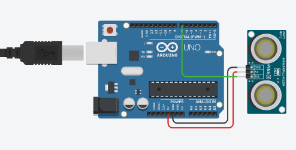
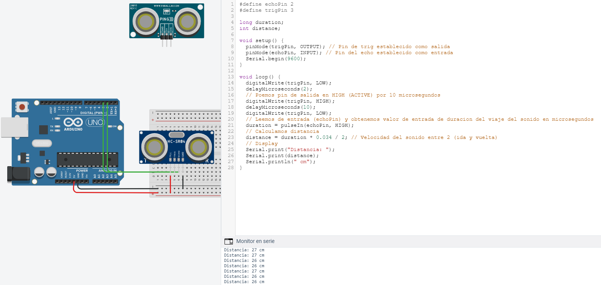
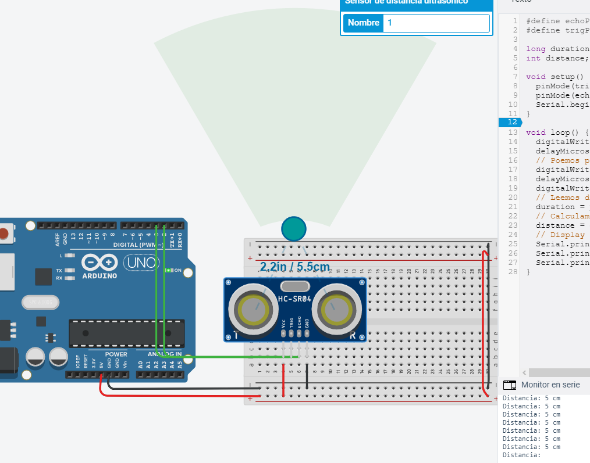
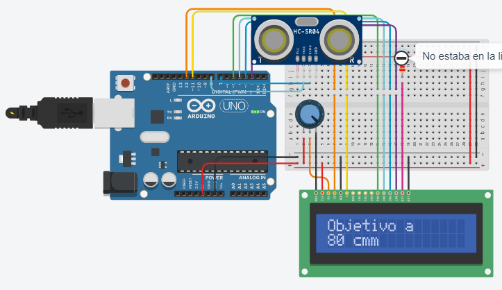
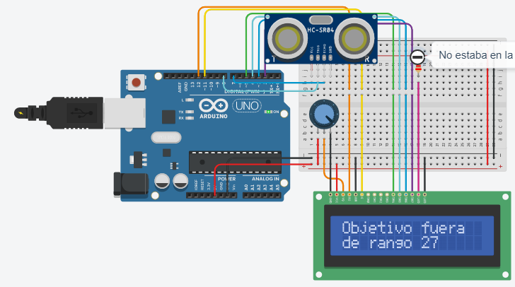
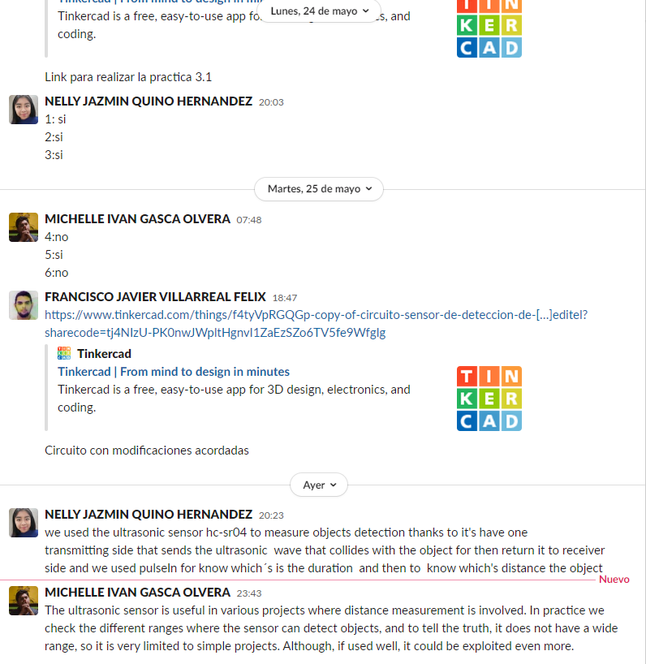

## :trophy: A.1.4 Learning Activity
Object detection sensor circuit, using an Arduino, an ultrasonic sensor and a 16x2 LCD I2C Display.

## :pencil2: Development

1. Use the following list of materials to prepare the activity

| Quantity | Description|
| -------- | ---------------------------------------------------------------------------------------------------------------------------------------------------------------------------------------------------------------------------------- |
| 1        | Sensor [Ultrasonico HC-SR04](https://www.amazon.com.mx/SainSmart-HC-SR04-Ranging-Detector-Distance/dp/B004U8TOE6/ref=sr_1_5?__mk_es_MX=%C3%85M%C3%85%C5%BD%C3%95%C3%91&dchild=1&keywords=hc-sr04&qid=1599005012&sr=8-5)            |
| 1         | Display LCD de 16x2
| 1        | 5V voltage source  |
| 1        | [1 10k potentiometer ](https://www.amazon.com.mx/Uxcell-a15011600ux0235-Linear-Rotary-Potentiometer/dp/B01DKCUVMQ/ref=sr_1_1?__mk_es_MX=%C3%85M%C3%85%C5%BD%C3%95%C3%91&dchild=1&keywords=potenciometro+10k&qid=1599005041&sr=8-1) |
| 1        | [Arduino UNO](https://www.amazon.com.mx/Progressive-Automations-LC-066-Arduino-Rev3/dp/B00WH5XOJK/ref=sr_1_7?__mk_es_MX=%C3%85M%C3%85%C5%BD%C3%95%C3%91&dchild=1&keywords=arduino+uno&qid=1599005073&sr=8-7)

2. Based on the image shown, assemble inside the simulator to be used, the electronic circuit indicated in **Figure 1**

 
    <strong>Figura 1 Sensor Ultrasonico</strong>
    

3. Carry out the program that allows, through one of the Arduino's inputs, to receive the value registered by the **Ultrasonic Sensor** when approaching an object at different distances.

 
    

 
    

4. Considering that the ultrasonic sensor has a minimum and maximum detection range based on the return time of the sonic signal, which values ​​are obtained in the simulation under the **following conditions:**

| Number | Condition 1 | Condition2 | The object is detected? |
| ------ | ----------------------------- | ------------------------------------------ | ----------------------- |
| 1 | 5 cm distance to the sensor | 0 degrees to the perpendicular axis of the sensor |Yes
| 2 | 50 cm distance to the sensor | 35 degrees to the perpendicular axis of the sensor |Yes
| 3 | 100 cm distance to the sensor | -35 degrees to the perpendicular axis of the sensor |Yes
| 4 | 5 cm distance to the sensor | 90 degrees to the perpendicular axis of the sensor |No
| 5 | 50 cm distance to the sensor | -60 degrees to the perpendicular axis of the sensor |Yes
| 6 | 350 cm distance to the sensor | 0 degrees to the perpendicular axis of the sensor|No

5. Once the previous points have been completed, add to Figure 1, **an I2C 16x2 LCD Display**, and place the image of the completed circuit up to this section.

 
    

6. When you have completed the integration of the I2C Display, set the program that allows you through the display to show the following message, **"Target detected at? Cm**, and if detection is not achieved, indicate the message **"Target out of range"**

 
    

7. Place here evidence that you consider important during the development of the activity.

 
    

 
    

## :beetle: Nelly Quino

We used the ultrasonic sensor hc-sr04 to measure objects detection thanks to it's have one transmitting side that sends the ultrasonic  wave that collides with the object for then return it to receiver  side and we used pulseIn for know which´s is the duration  and then to  know which's distance the object.

## :camera: Michelle Gasca

The ultrasonic sensor is useful in various projects where distance measurement is involved. In practice we check the different ranges where the sensor can detect objects, and to tell the truth, it does not have a wide range, so it is very limited to simple projects. Although, if used well, it could be exploited even more.

## :coffee: Francisco Villarreal 

The hc-sr04 ultrasonic sensor measures the distance using 2 sensors, one which sends a sound and the other which receives the sound and depending on the formula we use, we can measure the distance it traveled and make an estimate of where the object is placed.

### :bomb: Rubric

| Criteria| Description | Score |
| ------------- | -------------------------------------------------------------------------------------------- | ------- |
| Instructions | Do you fulfill each of the points indicated in the instruction section? | 10 |
| Sevelopment    | Did you answer each one of the points requested in the development of the activity?   | 60      |
|Demonstration|Was the student present in the explanation of the functionality of the activity?|20| 
|Conclusions|Se incluye una opinión personal de la actividad por cada uno de los integrantes del equipo?|10|

### :mortar_board: Members repositories
:beetle: [Nelly Quino](https://github.com/NellyQuino/SistemasProgramables)

:camera: [Michelle Gasca](https://github.com/C3XDN/Sistemas-programables)

:coffee: [Francisco Villarreal](https://github.com/FranciscoVF/Sistemas-Programables/)