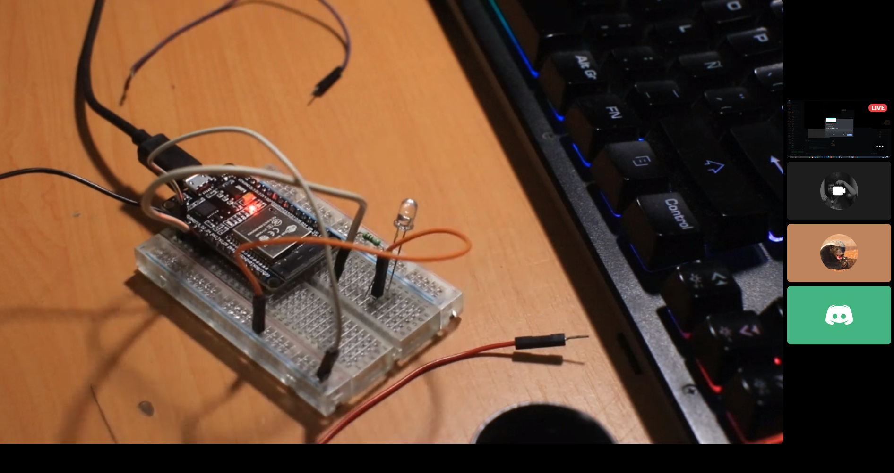
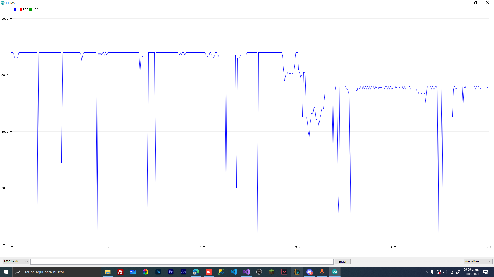

# :trophy: A.3.2 Learning Activity
Touch sensor circuit through a NodeMCU ESP32

## :pencil2: Development

1. Use the following list of materials to prepare the activity
Use the following list of materials to prepare the activity.

| Quantity | Description|
| -------- | -------------------------------------------------------------------------------------------------------------------------------------------------------------------------------------------------------------------------- |
| 1        | Red led diode|
| 1        | Resistance 330 ohms|
| 1        | 5V voltage source|
| 1        | [NodeMCU ESP32](https://www.amazon.com.mx/ESP-32-ESP-32S-ESP-WROOM-32-ESP32-S-desarrollo/dp/B07TBFC75Z/ref=sr_1_2?__mk_es_MX=%C3%85M%C3%85%C5%BD%C3%95%C3%91&dchild=1&keywords=esp32&qid=1599003438&sr=8-2) |
| 1        | [BreadBoard](https://www.amazon.com.mx/Deke-Home-Breadboard-distribuci%C3%B3n-electr%C3%B3nica/dp/B086C9HK7V/ref=sr_1_22?__mk_es_MX=%C3%85M%C3%85%C5%BD%C3%95%C3%91&dchild=1&keywords=breadboard&qid=1599003455&sr=8-22)   |
| 1        | [Jumpers M/M](https://www.amazon.com.mx/ELEGOO-Macho-Hembra-Macho-Macho-Hembra-Hembra-Protoboard/dp/B06ZXSQ5WG/ref=sr_1_1?__mk_es_MX=%C3%85M%C3%85%C5%BD%C3%95%C3%91&dchild=1&keywords=jumper+wires&qid=1599003519&sr=8-1) |
| 1        | Aluminum sheet

 
    <strong>Figura 1 Circuito ESP32 IC L293 Motor DC</strong>
    

2. Once the previous circuit is assembled, carry out a program that allows the assembly to meet the following conditions:
    - The system must be able to turn **an LED** on and off by pressing the touch sensor.
    - The system must have the characteristic that if the Led is on, when the touch sensor is touched, it will initiate an intermittent sequence of 3 seconds (that is, it turns off for 1 second, turns on for one second and finally turns off).
    - The system must have the characteristic that if the Led is off, when touching the touch sensor, it will turn on little by little until it reaches its maximum illumination level.

3. Place here evidence that you consider important during the development of the activity. Insert images of **evidence** such as meetings of the team members held for the development of the activity.

 
    

 
    

 
    

___

## :beetle: Nelly Quino

In this activity we made a circuit with the ESP32 Touch Sensor, we had to adjust the PWM data because it doesn't had them and we used touchRead() for read when someone touch the cable then the led turn on and serial monitor show a message. We had a lot problems due to noise so we coudn't have good results but finally we manage to get it working.

## :camera: Michelle Gasca

In this practice we configure a digital output, which we control by PWM and with cycles, we turn on and off an LED. The channel configuration to be able to control the LED is something very useful that, at least with Arduino, I never got to do because it was not entirely necessary but with the esp32 it is, and it is something interesting.

## :coffee: Francisco Villarreal 

During the activity we put together a touch sensor using the ESP32 to turn on an LED, at first we tried different ways to make the LED turn on and it was interesting to use the PWM to turn the LED on. We did encounter some difficulties, as we observed that it is sensitive to static, but otherwise we managed to make everything work properly.

### :bomb: Rubric

| Criteria| Description | Score |
| ------------- | -------------------------------------------------------------------------------------------- | ------- |
| Instructions | Do you fulfill each of the points indicated in the instruction section? | 10 |
| Sevelopment    | Did you answer each one of the points requested in the development of the activity?   | 60      |
|Demonstration|Was the student present in the explanation of the functionality of the activity?|20| 
|Conclusions|Se incluye una opinión personal de la actividad por cada uno de los integrantes del equipo?|10|

### :mortar_board: Members repositories
:beetle: [Nelly Quino](https://github.com/NellyQuino/SistemasProgramables)

:camera: [Michelle Gasca](https://github.com/C3XDN/Sistemas-programables)

:coffee: [Francisco Villarreal](https://github.com/FranciscoVF/Sistemas-Programables/)