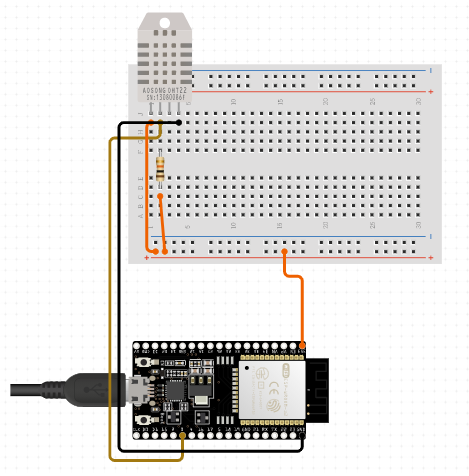
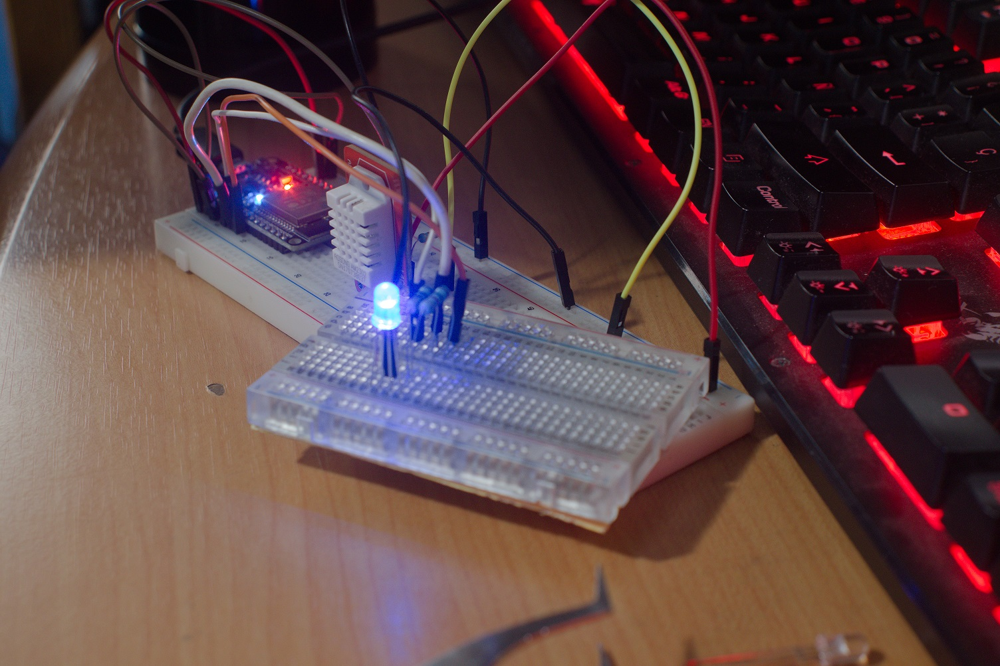
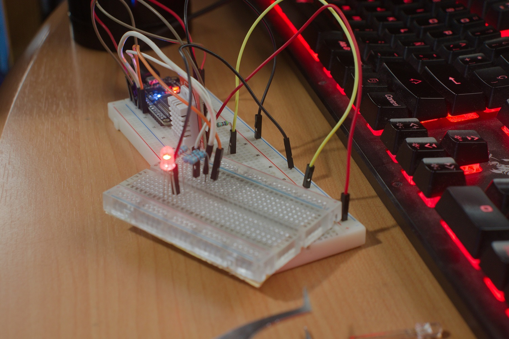
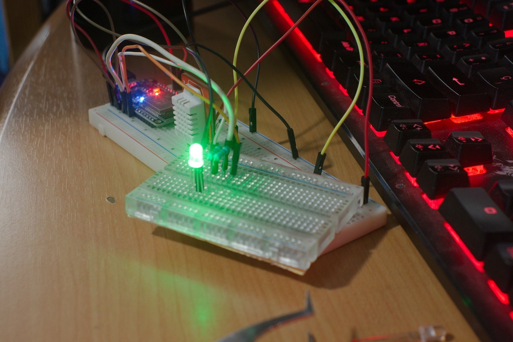
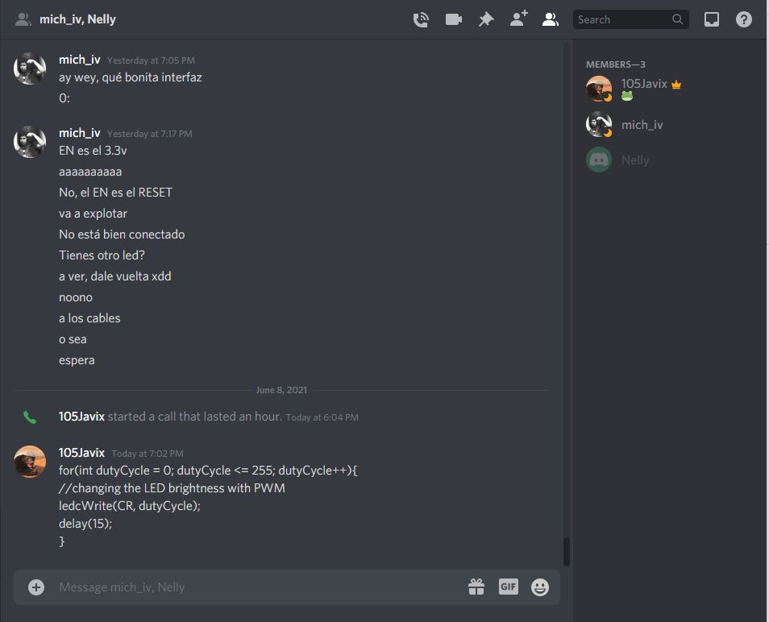
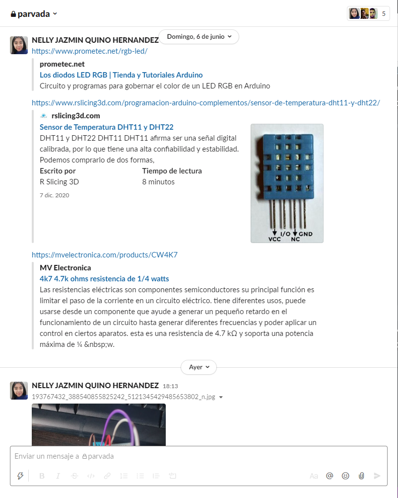
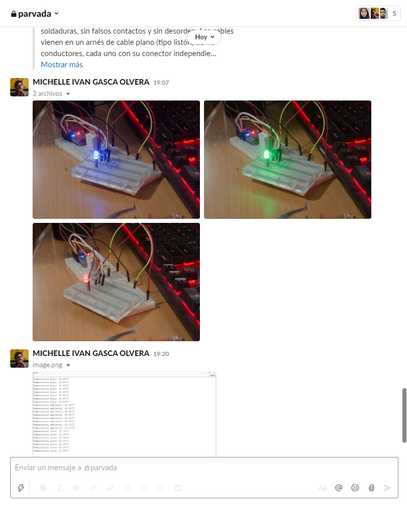

# :trophy: A.3.2 Learning Activity
Temperature measurement circuit through a NodeMCU ESP32

## :pencil2: Development

1. Use the following list of materials to prepare the activity

| Cantidad | Descripción | Source | 
| -------- | ----------------- | ----------------- |
| 1  | [DHT11 temperature and humidity sensor](https://articulo.mercadolibre.com.mx/MLM-664315278-sensor-de-temperatura-y-humedad-dht11-cjumpers-arduino-pic-_JM#position=1&type=item&tracking_id=b203e8cd-c375-429a-9b75-8c57e8b35386) or DHT22 | [rslicing3d](https://www.rslicing3d.com/programacion-arduino-complementos/sensor-de-temperatura-dht11-y-dht22/) |
| 1        | RGB led diode | [Promotec](https://www.prometec.net/rgb-led/) |
| 1        | Resistance 4.7 kohms| [mvelectronica](https://mvelectronica.com/products/CW4K7) |
| 3        | 1 kohm resistors | [mvelectronica](https://mvelectronica.com/products/MW1K) |
| 1        | 5V voltage source | [uelectronic](https://uelectronics.com/producto/fuente-de-alimentacion-5v-10a/) |
| 1        | [NodeMCU ESP32](https://articulo.mercadolibre.com.mx/MLM-587686290-esp32-wifi-bluetooth-42-ble-nodemcu-esp8266-libro-gratis-_JM#position=1&type=item&tracking_id=84a6234b-5016-47eb-9950-39b49846ca72)  | [Naylamp Mechatronics](https://naylampmechatronics.com/espressif-esp/384-nodemcu-32-esp32-wifi.htm) |
| 1        | BreadBoard  | [Learn Sparkfun](https://learn.sparkfun.com/tutorials/how-to-use-a-breadboard/all#why-use-breadboards) |
| 1        | Jumpers M/M | [Lozurytech](https://www.lozurytech.com/product-page/kit-de-jumpers-variados-m-m-h-m-h-h-120pcs) |

2. Based on the images shown in **Figure 1**, assemble the circuit into a single electronic circuit, in such a way that a system capable of complying with the instructions previously requested for this activity can be obtained.

 
    <strong>Figura 1 Circuito ESP32 y Sensor DHT</strong>
    

3. Once the above circuit is assembled, add an RGB LED and create the program that allows the RGB LED to function as an indicator for the following conditions:
    - The temperature sensor will be sensing at all times, sending the value registered by the serial terminal, for example "Ambient temperature: 25 degrees" and the **RGB LED** will be lit green.
    - When the temperature sensor registers a value of ~ 20% above the ambient temperature, it should display the message "High temperature:? Degrees" and the **RGB LED** will turn red.
    - When the temperature sensor registers a value of ~ 20% below the ambient temperature, it should display the message "Low temperature:? Degrees" and the **RGB LED** will turn blue.

4. Place here evidence that you consider important during the development of the activity.

 
    

 
    

 
    

 
    

5. Insert images of **evidence** such as meetings of the team members held for the development of the activity

 
    

 
    

 
    

 
    

## :beetle: Nelly Quino

DHT11 sensor is a digital sensor we can measure the humidity and temperature. In our case for this practice only used it for measuring the temperature also we used a RGB LED for showing three condictions  when we have a low temperature the led will on in color blue, en the second case when it´s ambient temperature the led will on color green y the last case when it´s high temperature the led will on color red. In this practice we had  problems when tried to upload the code but fortunately we could solvede it.

## :camera: Michelle Gasca

By doing this practice, I was able to know in detail the operation of the DHT22 sensor, and some curiosities of the ESP32 (specifically the D2 pin). We were able to measure the temperature and we made the LED change color by means of conditions that we adjusted depending on the ambient temperature registered by the sensor.

## :coffee: Francisco Villarreal 

During the practice with the DHT22 we had experience so detecting and measuring temperature was not a problem, but using the RGB LEDs we had no experience and less with the ESP32 with which we were having an error with which the program did not load, but my partner found that the origin was pin 2 we were using. Other than that, it was relatively easy to do the practice.

### :bomb: Rubric

| Criteria| Description | Score |
| ------------- | -------------------------------------------------------------------------------------------- | ------- |
| Instructions | Do you fulfill each of the points indicated in the instruction section? | 10 |
| Sevelopment    | Did you answer each one of the points requested in the development of the activity?   | 60      |
|Demonstration|Was the student present in the explanation of the functionality of the activity?|20| 
|Conclusions|Se incluye una opinión personal de la actividad por cada uno de los integrantes del equipo?|10|

### :mortar_board: Members repositories
:beetle: [Nelly Quino](https://github.com/NellyQuino/SistemasProgramables)

:camera: [Michelle Gasca](https://github.com/C3XDN/Sistemas-programables)

:coffee: [Francisco Villarreal](https://github.com/FranciscoVF/Sistemas-Programables/)