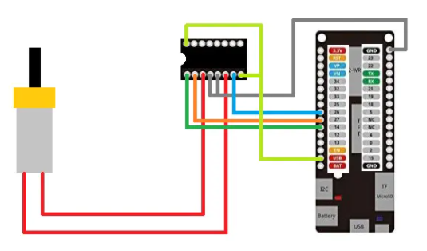
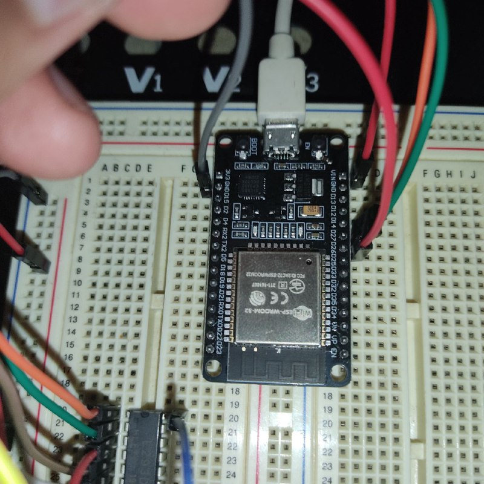
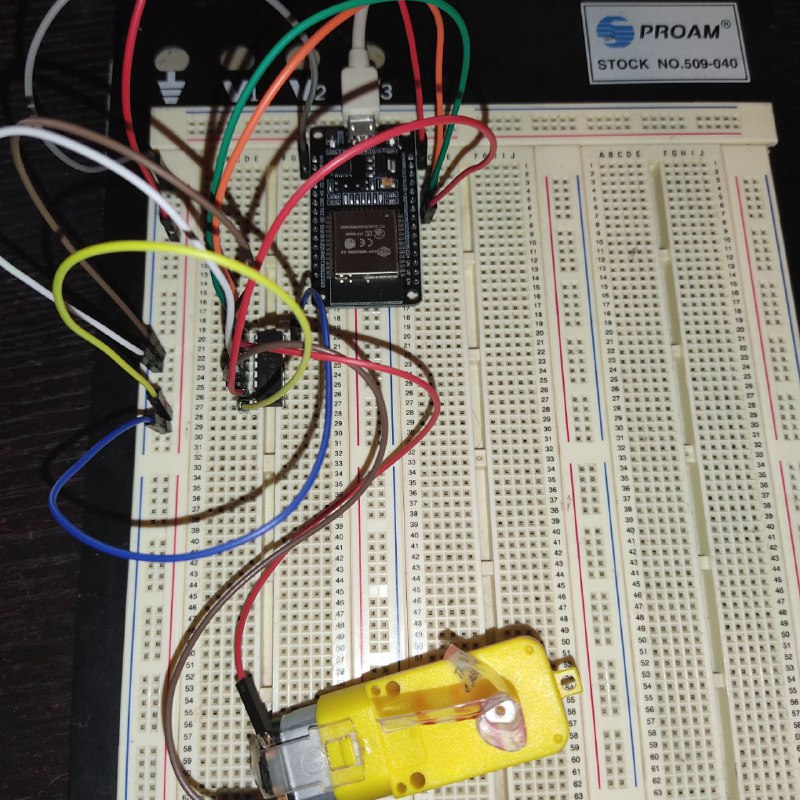
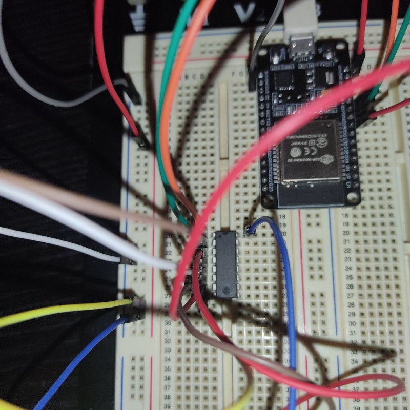
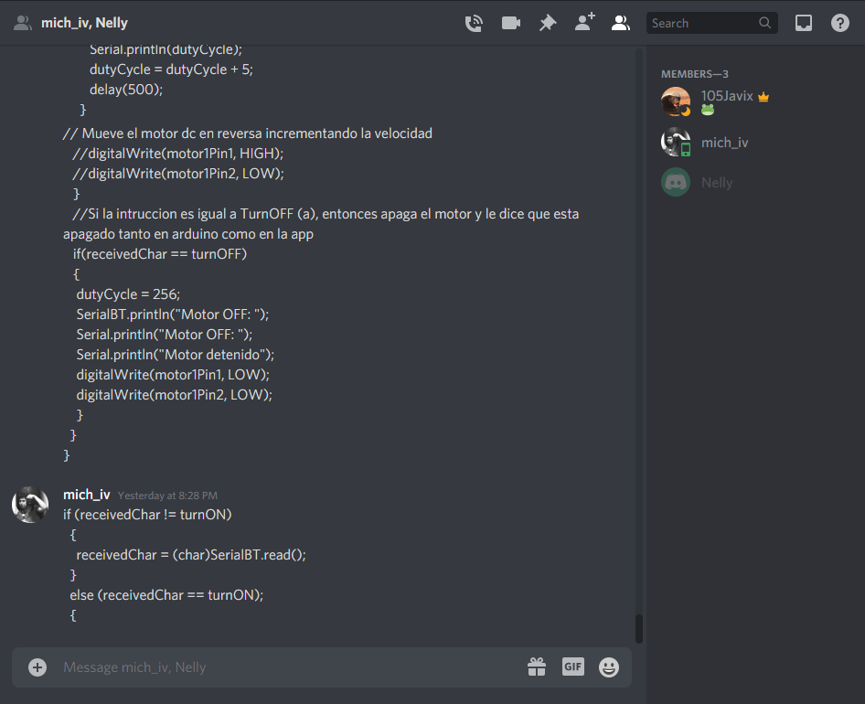
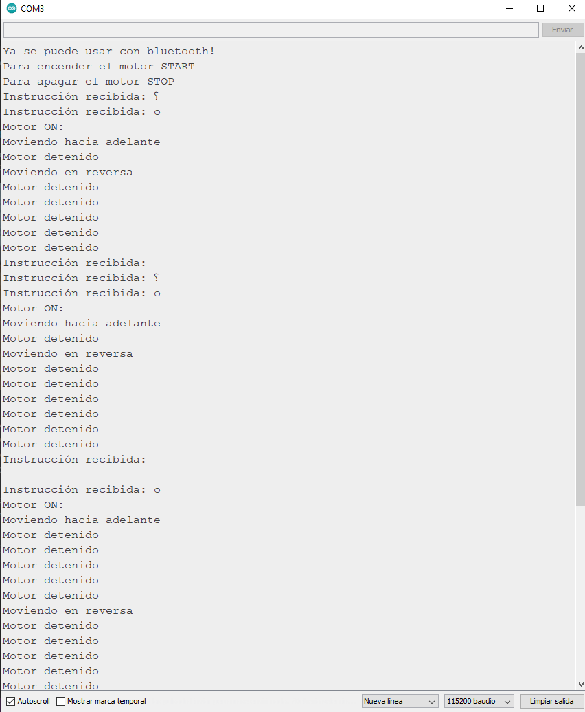
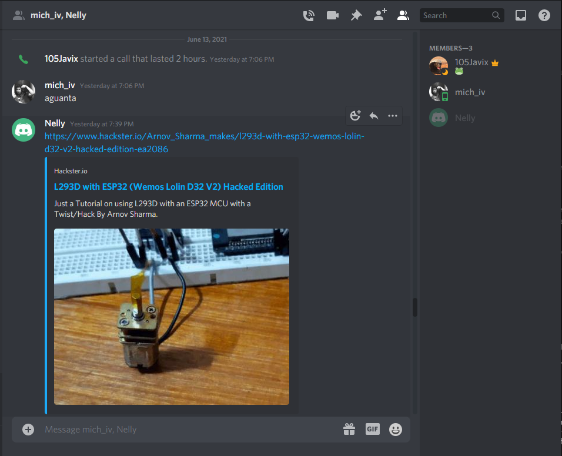
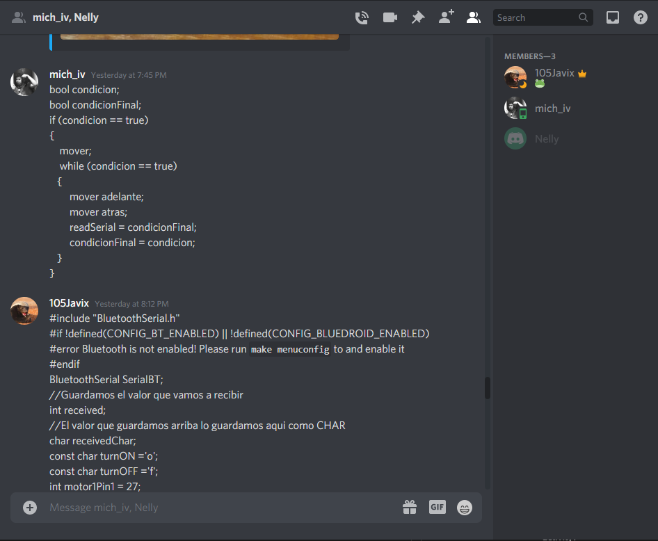

# :trophy: A.4.1 Learning Activity
Control circuit to activate and deactivate a DC motor, using NodeMCU ESP32 via Bluetooth.

## :pencil2: Development

1. Use the following list of materials to prepare the activity

| Amount | Description  |
| -------- | -------------------------------------------------------------------------------------------------------------------------------------------------------------------------------------------------------------------------- |
| 1        | [IC L293D]([https://www.amazon.com.mx/330ohms-M%C3%B3dulo-Sensor-Humedad-Temperatura/dp/B07Q4KWJQY/ref=sr_1_1?__mk_es_MX=%C3%85M%C3%85%C5%BD%C3%95%C3%91&dchild=1&keywords=sensor+dht11&qid=1599003418&sr=8-1)             |
| 1        | 5V voltage source  |
| 1        | [NodeMCU ESP32](https://www.amazon.com.mx/ESP-32-ESP-32S-ESP-WROOM-32-ESP32-S-desarrollo/dp/B07TBFC75Z/ref=sr_1_2?__mk_es_MX=%C3%85M%C3%85%C5%BD%C3%95%C3%91&dchild=1&keywords=esp32&qid=1599003438&sr=8-2)                |
| 1        | [BreadBoard](https://www.amazon.com.mx/Deke-Home-Breadboard-distribuci%C3%B3n-electr%C3%B3nica/dp/B086C9HK7V/ref=sr_1_22?__mk_es_MX=%C3%85M%C3%85%C5%BD%C3%95%C3%91&dchild=1&keywords=breadboard&qid=1599003455&sr=8-22)   |
| 1        | [Jumpers M/M](https://www.amazon.com.mx/ELEGOO-Macho-Hembra-Macho-Macho-Hembra-Hembra-Protoboard/dp/B06ZXSQ5WG/ref=sr_1_1?__mk_es_MX=%C3%85M%C3%85%C5%BD%C3%95%C3%91&dchild=1&keywords=jumper+wires&qid=1599003519&sr=8-1) |
| 1| DC Motor |

2. Based on the images shown in **Figure 1**, assemble an electronic circuit, in order to obtain a system capable of complying with the following instructions:

+ Through the application "Serial Bluetooth terminal" that can be downloaded from the google play Store or even any other that you consider, you must control the start and shutdown of a DC motor, that is, there will be two requests, one of which one of them will represent the **"START" and the other option "STOP"**
+ The motor must be able to rotate clockwise for 5 seconds, at the end of that time it must brake for 1 second and reverse its rotation for another 5 seconds, that is, the activity must have the following sequence: The **stop** can be executed at any time, and the engine will be executing 5s forward, 1s stop, 5s reverse, 1s stop, 5s forward, 1s stop, 5s reverse, ...

 
    <strong>Figura 1 Circuito ESP32 IC L293 Motor DC</strong>
    

3. Place the image of the assembled circuit here.

 
    

 
    

 
    

4. Place in this place the program created within the Arduino environment
~~~
#include "BluetoothSerial.h"
#if !defined(CONFIG_BT_ENABLED) || !defined(CONFIG_BLUEDROID_ENABLED)
#error Bluetooth is not enabled! Please run `make menuconfig` to and enable it
#endif
BluetoothSerial SerialBT;
//El valor que guardamos arriba lo guardamos aqui como CHAR
char receivedChar;
char charTemporal;
const char turnON ='o';
const char turnOFF ='f';
int motor1Pin1 = 27;
int motor1Pin2 = 26;
int enable1Pin = 14;
// Propiedades PWM
const int freq = 30000;
const int pwmChannel = 0;
const int resolution = 8;
int dutyCycle = 200;
bool flag = false;

void setup() {
  Serial.begin(115200);
  //Le ponemos el nombre que queramos a nuestro esp32
  SerialBT.begin("ESP32_Parvada");
  Serial.println("Ya se puede usar con bluetooth!");
  //Esto se imprime en el smonitor de arduino
  Serial.println("Para encender el motor START");
  Serial.println("Para apagar el motor STOP");
  // sets the pins as outputs:
  pinMode(motor1Pin1, OUTPUT);
  pinMode(motor1Pin2, OUTPUT);
  pinMode(enable1Pin, OUTPUT);
  ledcSetup(pwmChannel, freq, resolution);
  // attach the channel to the GPIO to be controlled
  ledcAttachPin(enable1Pin, pwmChannel);
  }
  
void loop() {
  charTemporal = SerialBT.read();
  if (Serial.available() > 0) 
  {
    SerialBT.write(Serial.read());
  }
  //Aqui le asignamos la variable para guardar lo que va a leer como instruccion
  if (charTemporal == turnON || turnOFF )
  {
    receivedChar = charTemporal;
  }
  else (receivedChar == turnON);
  {
    //Si el serailBT esta disponible entonces le manda las lineas siguientes
  if (SerialBT.available() > 0) 
  {
    //Esto aparece en la app
    SerialBT.print("Instrucción recibida: ");
    //Aqui imprime la intruccion que se ingreso
    SerialBT.println(receivedChar);
    Serial.print ("Instrucción recibida: ");
    Serial.println(receivedChar);
  }
    if(receivedChar == turnON || flag==true )
    {
      flag = true;
      dutyCycle = 255;
      while (dutyCycle <= 255)
      {
        ledcWrite(pwmChannel, dutyCycle);
        //Serial.print("Adelante con el ciclo de trabajo: ");
        //Serial.println(dutyCycle);
        dutyCycle = dutyCycle + 5;
        delay(500);
     }
   SerialBT.println("Motor ON: ");
   Serial.println("Motor ON: ");
   // Mueve el motor dc hacia adelante
   Serial.println("Moviendo hacia adelante");
   digitalWrite(motor1Pin1, LOW);
   digitalWrite(motor1Pin2, HIGH);
   delay(1000);
   st();
   delay(1000);
   st();
   delay(1000);
   st();
   delay(1000);
   st();
   delay(1000);
   st();
   // Detiene el motor
   Serial.println("Motor detenido");
   digitalWrite(motor1Pin1, LOW);
   digitalWrite(motor1Pin2, LOW);
   delay(1000);
   st();
   // Mueve el motor dc en reversa
   Serial.println("Moviendo en reversa");
   digitalWrite(motor1Pin1, HIGH);
   digitalWrite(motor1Pin2, LOW);
   delay(1000);
   st();
   delay(1000);
   st();
   delay(1000);
   st();
   delay(1000);
   st();
   delay(1000);
   st();
   // Detiene el motor
   Serial.println("Motor detenido");
   digitalWrite(motor1Pin1, LOW);
   digitalWrite(motor1Pin2, LOW);
   delay(1000);
   st();
   }
  }
}

static void st(){
   charTemporal = SerialBT.read();
   if (charTemporal == turnON || turnOFF )
  {
    receivedChar = charTemporal;
  }
   //Si la intruccion es igual a TurnOFF, entonces apaga el motor
   if(receivedChar == turnOFF || flag ==false)
   {
    flag = false;
    SerialBT.println("Motor detenido: ");
    Serial.println("Motor detenido");
    digitalWrite(motor1Pin1, LOW);
    digitalWrite(motor1Pin2, LOW);
    delay(500);
    }
}
~~~

5. Place here evidence that you consider important during the development of the activity.

 
    

 
    

6. Insert images of **evidence** such as meetings of the team members held for the development of the activity.

 
    

 
    

## :beetle: Nelly Quino

In this practice we used the ESP32 with the L293D motor, through Bluetooth the motor had to turn on when we give the on instruction  to rotate it  for 5 seconds and turn off for 1 second then should it rotate the other way  for 5 second and  turndout for 1 second and  it rotate  the other way again and this case needs repete until  the motor  receive the off intruction to fulfill the purpose the this activite in the code we implemented a serie of if for turning on and off the motor and used a flag for turning  on the motor until receive the off  instruction

## :camera: Michelle Gasca

In this practice we learned to use the different forms of serial communication of the ESP32. the use of an H-bridge, in addition to the use of conditions that allowed us to start and stop the engine when we specified it, and at the same time, the specified objectives.

## :coffee: Francisco Villarreal 

During practice we used the ESP32 a dc motor and controlled it with the cell phone via bluetooth, it was relatively easy to connect the ESP32 to the cell phone with bluetooth, since there were many tutorials, but the difficult thing was to make it possible for us to have a control engine and that it kept in the cycle of turns, since it stopped as soon as one finished one although the condition to stay in the cycle had been fulfilled, after that what was fought with was to make it stop at any time when We will tell you, for this we divide the seconds in which the program is executing and we create a method that is reading when to stop in that way in any second of the program we can stop the motor.

### :bomb: Rubric

| Criteria| Description | Score |
| ------------- | -------------------------------------------------------------------------------------------- | ------- |
| Instructions | Do you fulfill each of the points indicated in the instruction section? | 10 |
| Sevelopment    | Did you answer each one of the points requested in the development of the activity?   | 60      |
|Demonstration|Was the student present in the explanation of the functionality of the activity?|20| 
|Conclusions|Se incluye una opinión personal de la actividad por cada uno de los integrantes del equipo?|10|

### :mortar_board: Members repositories
:beetle: [Nelly Quino](https://github.com/NellyQuino/SistemasProgramables)

:camera: [Michelle Gasca](https://github.com/C3XDN/Sistemas-programables)

:coffee: [Francisco Villarreal](https://github.com/FranciscoVF/Sistemas-Programables/)