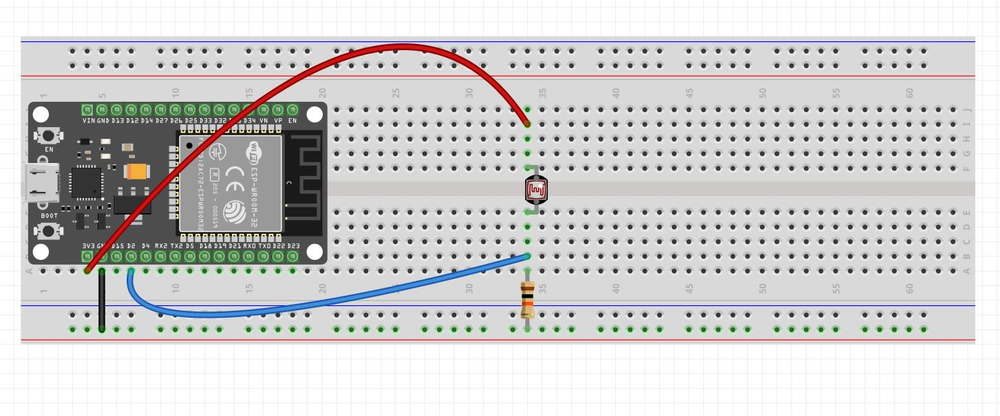
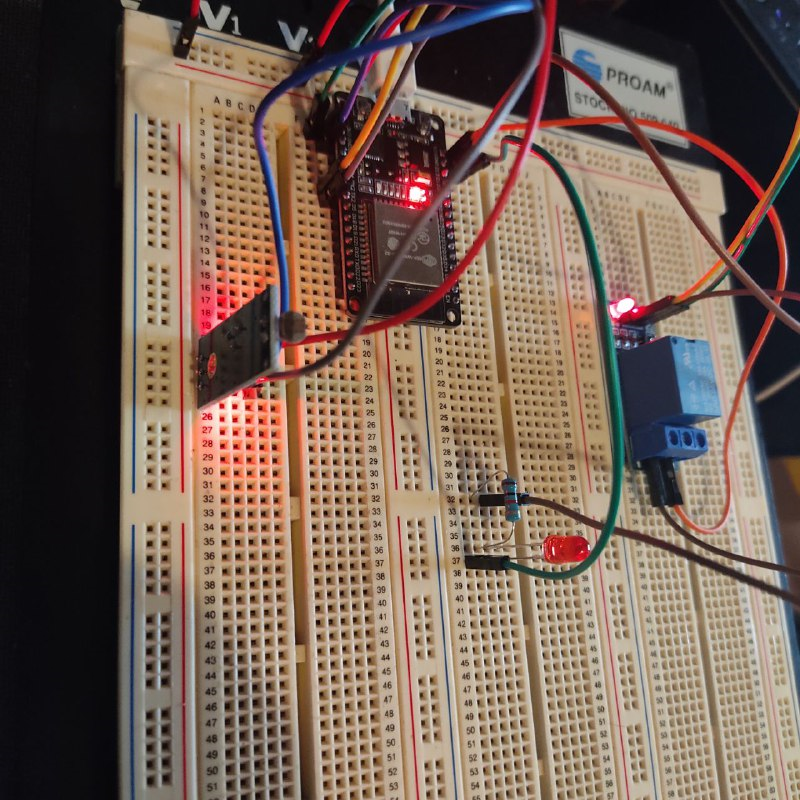
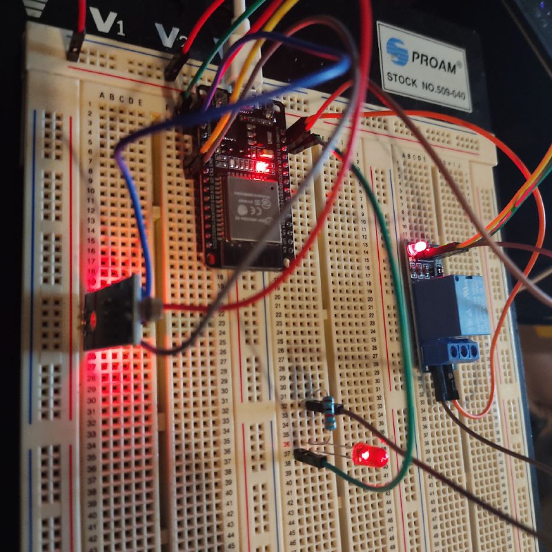
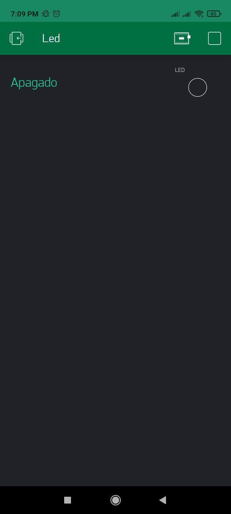
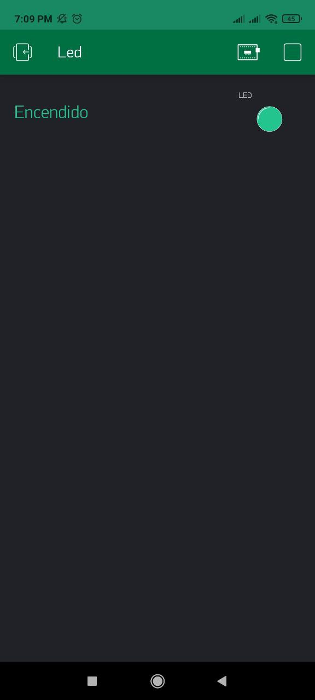
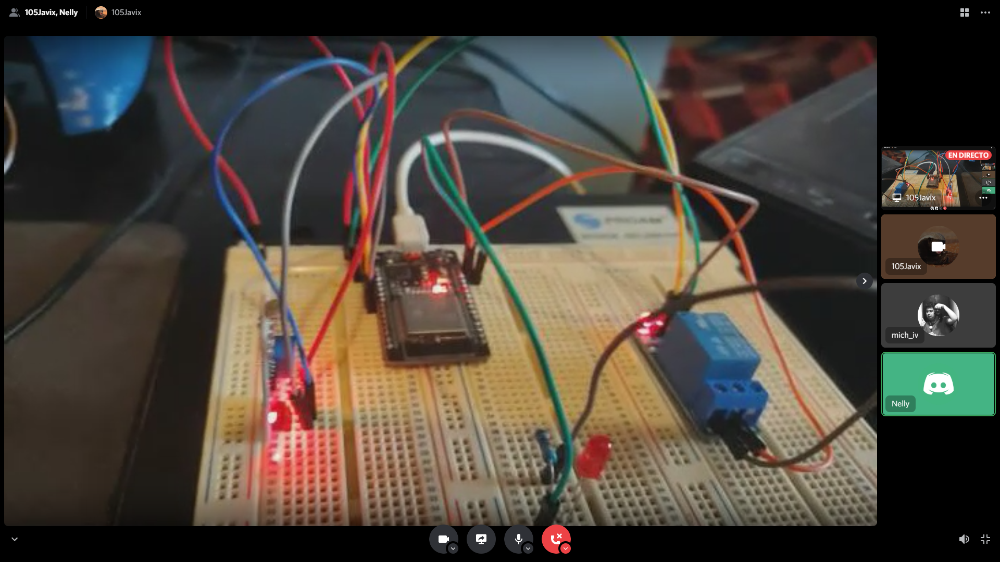
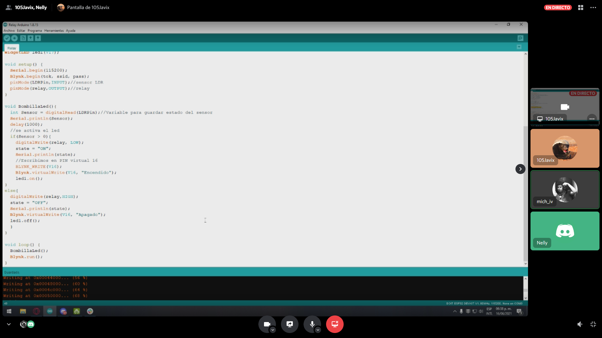

# :trophy: A.4.2 Learning Activity
NodeMCU ESP32 light actuation and lighting sensor circuit via Wi-Fi.

## :pencil2: Development

1. Use the following list of materials to prepare the activity

| Quantity | Description   | Link |
| -------- | -------------- | -------------- |
| 1        | [Modulo Sensor LDR]([https://articulo.mercadolibre.com.mx/MLM-623282168-modulo-sensor-de-luz-ldr-_JM)  | [Prometec](https://prometec.mx/producto/ldr-sensor-de-luz/) |
| 1 | Rele de 3.3v | [Altronics](https://altronics.cl/modulo-rele-5v-optoacoplado) |
| 1 | Bombilla (LED)  | [Geek Bot Electronics](https://geekbotelectronics.com/producto/led-difuso-rojo-5-mm/#:~:text=La%20tecnología%20conocida%20como%20LED,Es%20un%20componente%20optoelectrónico%20pasivo.) |
| 1        | Fuente de voltaje de 5V | [UElectronic](https://uelectronics.com/producto/fuente-de-alimentacion-5v-10a/) |
| 1        | [NodeMCU ESP32](https://www.amazon.com.mx/ESP-32-ESP-32S-ESP-WROOM-32-ESP32-S-desarrollo/dp/B07TBFC75Z/ref=sr_1_2?__mk_es_MX=%C3%85M%C3%85%C5%BD%C3%95%C3%91&dchild=1&keywords=esp32&qid=1599003438&sr=8-2) | [Naylamp Mechatronics](https://naylampmechatronics.com/espressif-esp/384-nodemcu-32-esp32-wifi.htm) |
| 1        | [BreadBoard](https://www.amazon.com.mx/Deke-Home-Breadboard-distribuci%C3%B3n-electr%C3%B3nica/dp/B086C9HK7V/ref=sr_1_22?__mk_es_MX=%C3%85M%C3%85%C5%BD%C3%95%C3%91&dchild=1&keywords=breadboard&qid=1599003455&sr=8-22)   | [Learn Sparkfun](https://learn.sparkfun.com/tutorials/how-to-use-a-breadboard/all#why-use-breadboards) |
| 1        | [Jumpers M/M](https://www.amazon.com.mx/ELEGOO-Macho-Hembra-Macho-Macho-Hembra-Hembra-Protoboard/dp/B06ZXSQ5WG/ref=sr_1_1?__mk_es_MX=%C3%85M%C3%85%C5%BD%C3%95%C3%91&dchild=1&keywords=jumper+wires&qid=1599003519&sr=8-1) | [Lozurytech](https://www.lozurytech.com/product-page/kit-de-jumpers-variados-m-m-h-m-h-h-120pcs) |

2. Based on the image shown in **Figure 1**, assemble an electronic circuit and add a Led and a relay to one of the device's terminals, in such a way that a system capable of complying with the following instructions:
    - The NodeMCU should be used as a **standalone Web server**, which should provide a visual interface, which will show an image representing an "ON and OFF" behavior depending on the ambient lighting condition.
    - The lighting sensor must be measuring the amount of light that exists in the environment.
    - When detecting the LDR sensor, the absence of light should show an "ON" status on the Web interface, and otherwise the "OFF" status should be represented.
    - A relay in series with a light bulb must be added to the circuit in figure 1, which will be activated in the opposite condition to the "ON" and "OFF" state, that is, once the sensor detects little or no lighting, it will activate the relay. and consequently it will turn on the bulb, and otherwise it will turn it off.

[Random Nerd Tutorial Support Source](https://randomnerdtutorials.com/esp32-web-server-arduino-ide/)

 
    <strong>Figura 1 Circuito ESP32 Sensor LDR iluminacion</strong>
    

3. Place the image of the assembled circuit here

 
    

 
    

 
    

4. Place in this place the program created within the Arduino environment

~~~
//Librerias del BLYNK
#include <BlynkSimpleEsp32.h>
#define BLYNK_PRINT Serial

#include <WiFi.h>
#include <WiFiClient.h>
//Token generado por la aplicacion de blynk
char tok[] = "WKs-osgDC6f4cT2hXCMz92Ii68d6efo0";
//Datos para la conexion
char ssid[] = "INFINITUMM";
char pass[] = "5555555555";
//para el estado del led
String state = "";

//sensor y relay
const int LDRPin = 17;
const int relay = 16;
//Pin virtual 17 para cambiar el led de la app
WidgetLED led1(V17);

void setup() {
  Serial.begin(115200);
  Blynk.begin(tok, ssid, pass);
  pinMode(LDRPin,INPUT);//sensor LDR
  pinMode(relay,OUTPUT);//relay
}

void BombillaLed(){
  int Sensor = digitalRead(LDRPin);//Variable para guardar estado del sensor
  Serial.println(Sensor);
  delay(1000);
  //se activa el led
  if(Sensor > 0){
    digitalWrite(relay, LOW);
    state = "ON";
    Serial.println(state);
    //Escribimos en PIN virtual 16
    BLYNK_WRITE(V16);
    Blynk.virtualWrite(V16, "Encendido");
    led1.on();
}
else{
  digitalWrite(relay,HIGH);
  state = "OFF";
  Serial.println(state);
  Blynk.virtualWrite(V16, "Apagado");
  led1.off();
  }
}

void loop() {
  BombillaLed();
  Blynk.run();
}
~~~

5. Place here evidence that you consider important during the development of the activity.

 
    

 
    

6. Insert images of **evidence** such as meetings of the team members held for the development of the activity

 
    

 
    

## :beetle: Nelly Quino

In this practice we used the ESP32 with the Wi-Fi communication protocol, a LDR sensor and a LED. We assembled the circuit based on the image provided to us, in the moment when we assambled the circuit we had a problem when try to used the GND because the cuircuit didn´t detect it so we conected it direcly in the ESP32 we know that's not recommended but in this case we had no other. Once already armed the circuit we needed to do was show a on messege when the LDR sensor wasn't detect the lights and show the off message when it detect the lights after then we integrated a LED and a reley to saw the changes better and finally in the code use a virtual varible to comunicate with the Wi-Fi app.

## :camera: Michelle Gasca

When doing this practice, we configure the ESP32 module for the first time to access a WiFi network, and thus use an application from a cell phone. Regarding the part of the remote interface programming, it was a bit confusing at first, but when we practiced, we knew how to make the necessary adjustments to be able to receive the data from the led when it was turned off or on. Also, the use of the relay was somewhat unknown at first, but as the practice and development of the same code, we understood that it was a type of logic gate, and it worked as a condition in our circuit. The photoresistance acted as the condition to turn on the led, because when it stopped detecting light, it turned it on and vice versa.

## :coffee: Francisco Villarreal 

During the practice that we used the relay, ESP32 and the LDR it was relatively easy to make the LED turn on with the LDR and with the relay we were concerned about the voltage, since many videos and pages warned us to be careful and we did not want to burn anything or hurt ourselves , but since we did the practice with LEDs instead of a light bulb it was simple, at first we had a problem with what the earth was, since for some reason it did not detect it, but we put it next to the ESP32 and it managed to work. Finally, the interface that we can see through wifi, we opted to use blynk, since it did not saturate the code interface and it was easier to use, since with the virtual pins we could see that the led turns on and off.

### :bomb: Rubric

| Criteria| Description | Score |
| ------------- | -------------------------------------------------------------------------------------------- | ------- |
| Instructions | Do you fulfill each of the points indicated in the instruction section? | 10 |
| Sevelopment    | Did you answer each one of the points requested in the development of the activity?   | 60      |
|Demonstration|Was the student present in the explanation of the functionality of the activity?|20| 
|Conclusions|Se incluye una opinión personal de la actividad por cada uno de los integrantes del equipo?|10|

### :mortar_board: Members repositories
:beetle: [Nelly Quino](https://github.com/NellyQuino/SistemasProgramables)

:camera: [Michelle Gasca](https://github.com/C3XDN/Sistemas-programables)

:coffee: [Francisco Villarreal](https://github.com/FranciscoVF/Sistemas-Programables/)